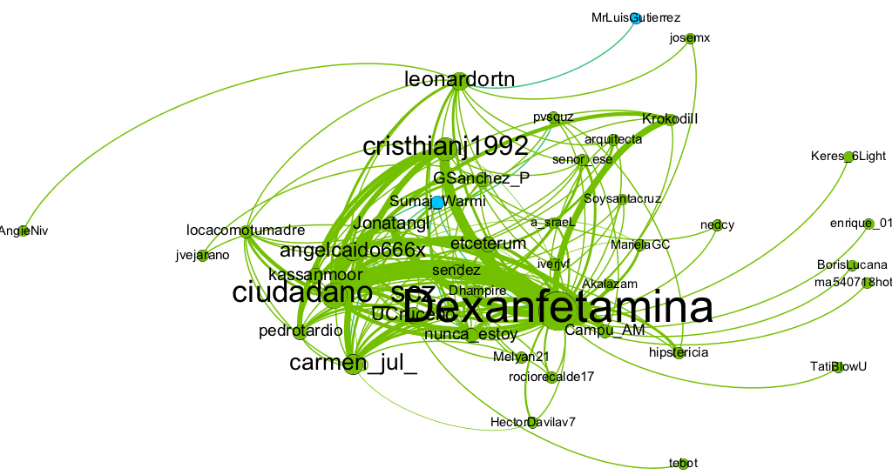
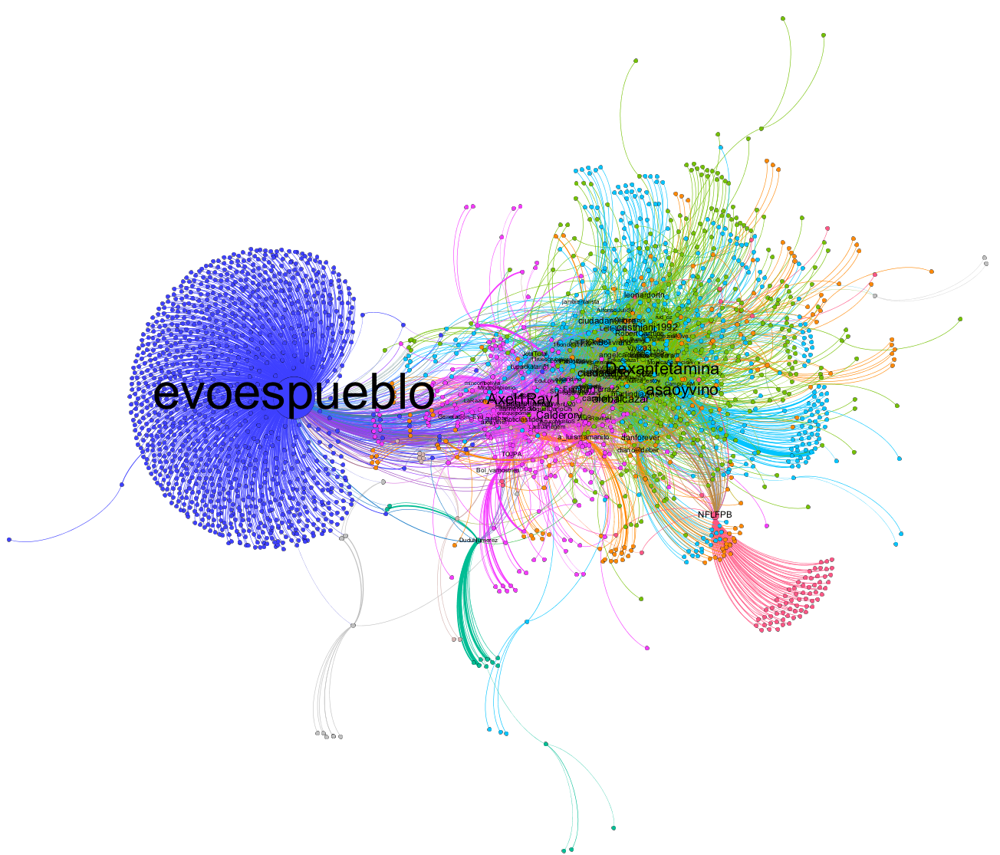
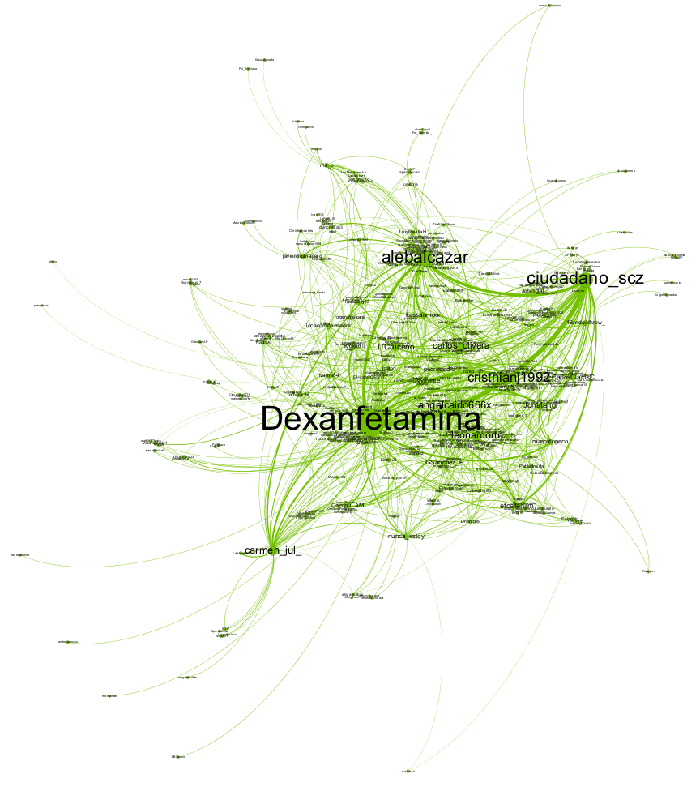
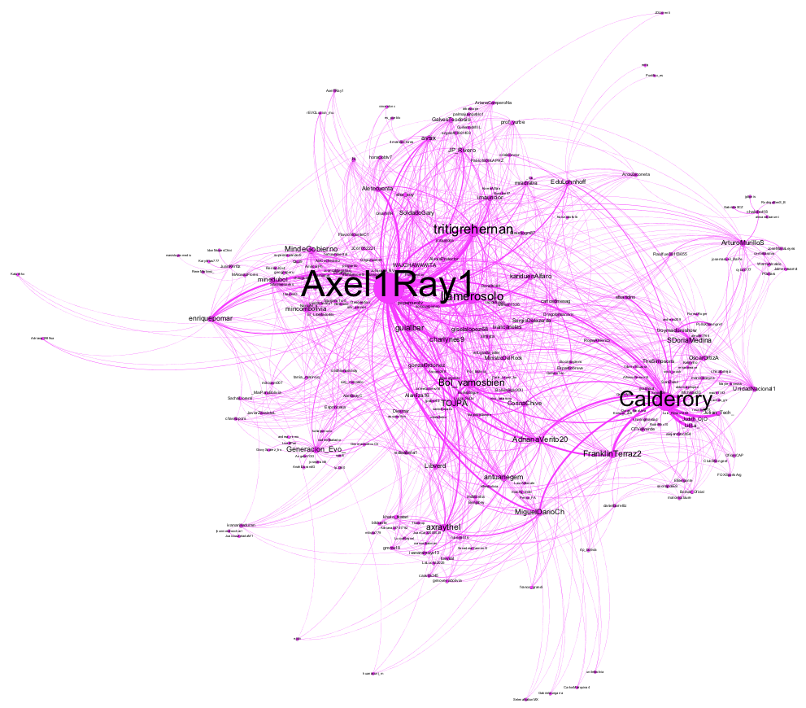
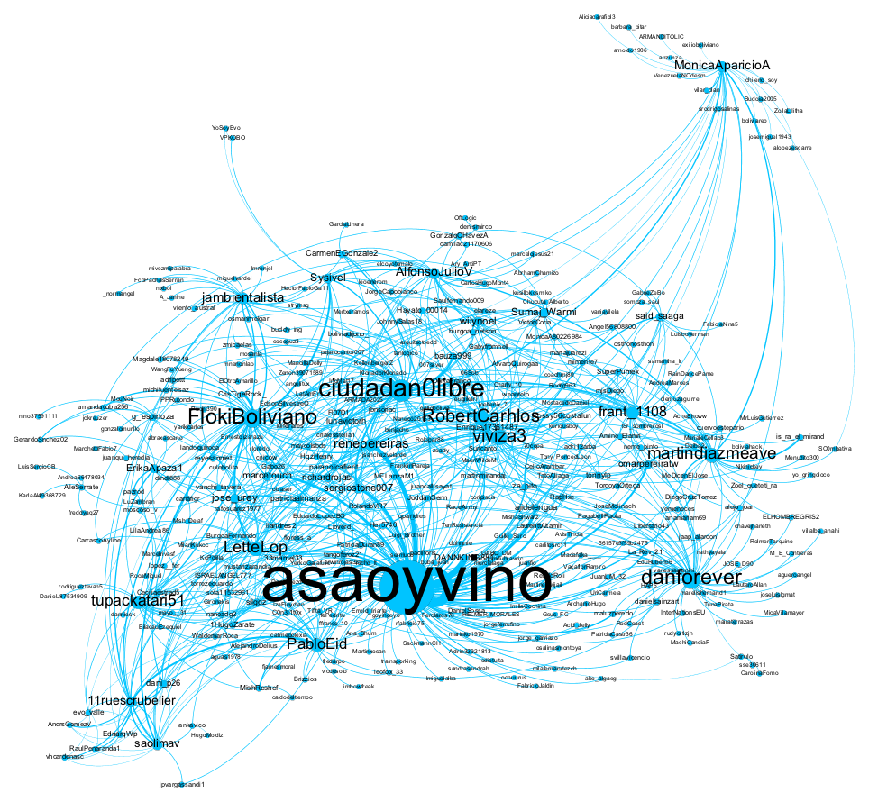
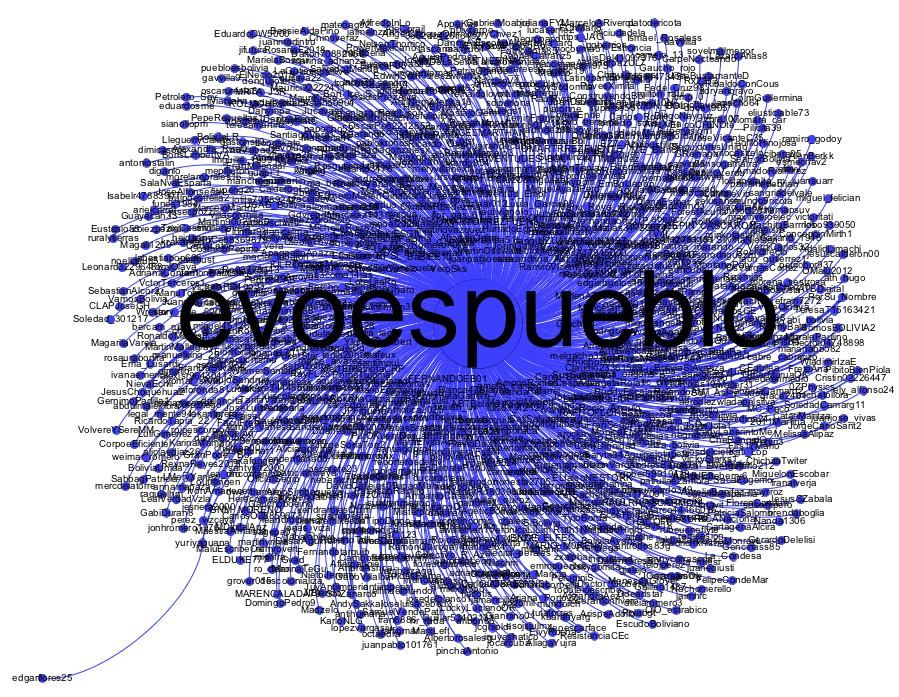
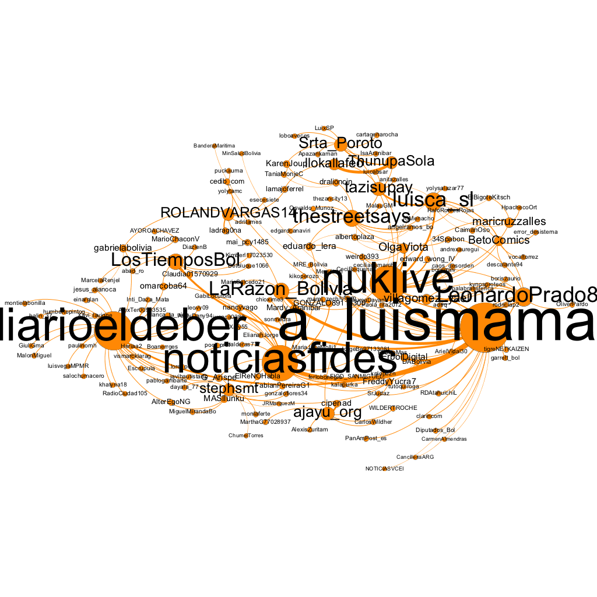
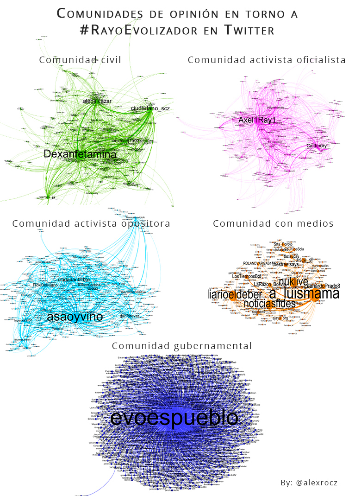

## Introducción

Los hashtags son objetos digitales "nativos" (Rogers 2013). Si bien hay objetos en el mundo digital que tienen un paralelo en la vida offline, como el texto y la imagen, que preexistian a la digitalización, existen otros objetos que nacen con la Web. El hashtag es un desarrollo particular del hiperenlace, un centro de convergencia temático entre los multiples hilos de la Web, un hiperespacio donde convergen algunas de esas *lineas* de vida, no rectas, de las que nos hablaba Ingold (2015).

En nuestro país el uso de hashtags no parece tan extendido como en otras latitudes. Sin embargo, en el ultimo tiempo se ha visto el uso relativamente masivo de varios de ellos, como un agregador de sentidos, demandas y actividades, principalmente por grupos activistas; por ejemplo, #TipnisEnResistencia, #MejorInternetYa, #NiUnaMenos, y recientemente #BoliviaDijoNo, #21FDiaDeLaMentira y #Paro21F. El uso de hashtags tiene claras ventajas para los usuarios, pero también para los análistas de redes sociales que constantemente tienen que naugragar en cantidades enormes de datos y conversaciones caóticas dispersas en diversos espacios. Aquí el hashtag funciona como un agregador de opinión pública. 

La pasada semana nació una tendencia en las redes que tenía como eje central la figura del presidente Evo Morales. El hashtag #Rayoveolizador nació en Twitter, como un remix de otros hashtags similares en otros paises, y rapidamente se expandió a otras plataformas. El centro son los memes que son parte "del remix y la cultura participativa en la que los usuarios agregan, apropian, imitan, parodian, remezclan, editorializan y transforman el contenido original de alguna manera" (Vicery 2015: 1450) Pero además los memes de #RayoEvolizador más allá del contenido visual, portan textos, usuarios, grupos, opiniones, contraopiniones, antagonismos, pulsiones y tácticas.

Si bien parece simplemente un hashtag de "ocio", en realidad es un hashtag políticamente relevante por las siguientes razones. Primero tiene como centro temático a la imagen del presidente del país. Segundo es una muestra acotadada de una nueva forma de generar opinión pública en las redes: la de la sátira política en red, una combinación de diversión y crítica. Y tercero, en este hashtag han confluido dos dinámicas distintas, la dinámica civil espontanea y la dinámica política planificada, la primera mås participativa y caótica y la segunda más centralizada y planificada.

El objetivo de este artículo es el de analizar las dinámicas estructurales de opinión en torno al hashtag #RayoEvolizador en Twitter. Por dinåmica estructural entendemos el conjunto de patrones de redes de comunicación, y no asi las dinåmicas de contenido que dejamos para otro estudio. Para ello utilizaremos principalmente técnicas del *Social Network Analysis* (SNA), particularmente los algoritmos de detección de comunidades[^1], tambien llamados modulos, y algunas medidas de centralidad nodal. El *Análisis de Redes Sociales* es "un método estructural-relacional, formal y cuantitativo que se interesa por los patrones de relaciones e interacciones entre los actores" (Ojeda 2015: 17). Este método nos permitirá identificar algunos patrones relevantes en las dinámicas de opinión y agrupación que de otro modo no serían visible mediante, por ejemplo, la etnografía o la estadistica tradicional. 

## Recolección de datos

Hemos recolectado todos los tweets que contienen el hashtag #RayoEvolizador, desde su creación el 28 de febrero de 2018 hasta el 5 de marzo de 2018 (censo), mediante el paquete `SocialMediaLab`:

```{r eval=FALSE}
library(SocialMediaLab)
library(magrittr)

# Autenticación y recolección de datos
rayo <- Authenticate("twitter", apiKey = "", apiSecret="", accessToken="", accessTokenSecret="") %>% Collect(searchTerm="#rayoevolizador", numTweets=1500, verbose=TRUE, maxID = "967395488524795904") 
```

A partir de varias iteraciones, conseguimos un dataset de 6218 tweets:

```{r}
rayo
```

Dado que nos concentraremos en las formas de conversación, de momento no nos interesa el contenido de la variable *text*, por lo que solo utilizaremos las siguientes variables: *from_user*, *reply_to* y *users_mentioned*. A partir de ellas crearemos una *red de actores* donde los *nodos* representan usuarios de Twitter que participaron en el hashtag y las *aristas* representan una mención, réplica o retweet de un usario $i$ hacia un usuario $j$ dado un tweet $k$.

```{r eval=FALSE}
library(igraph)

# Creamos la red en una estructura de datos apropiada (clase: igraph)
rayoactor <- rayo %>% Create("actor") 
```

Guardamos los datos en formato GraphML para luego medirlo y visualizarlo en Gephi.

```{r eval=FALSE}
write.graph(rayoactor, "rayoactor.graphml", "graphml")
```

## Resultados

### Frecuencia de los tweets y origen del hashtag

Todos los fenómenos virales tienen un origen, una difusión y un decaimiento, siguiento la categorización de [KnowYourMeme](http://knowyourmeme.com/). Para el caso de #RayoEvolizador, mostramos a continuación esos picos de generación de tweets en el tiempo:

```{r fig.width = 15}
library(rtweet)
library(ggplot2)
ts_plot(rayo, "hours") +
    theme_minimal() +
    scale_x_datetime(date_breaks = "1 day", date_label = "%m-%d") +
    labs(x = "Tiempo", y = "Número de tweets",
    title = "Figura 1. Frecuencia de tweets sobre #RayoEvolizador",
    subtitle = "",
    caption = "Fuente: Elaboración propia a partir de datos recolectados de la API de Twitter"
  )
```

El pico mås alto de producción de mensajes se da el día de creación del hashtag, el 28 de febrero. Aunque hay un cierto remonte el 2 de marzo después de que @evoespueblo y la prensa le prestan atención al hashtag. 

La primera comunidad en aparecer el 28 de febrero es la que surge alrededor del primer tweet del usuario @dexanfetamina, un usuario cruceño. Esta comunidad evolucionará para ser la comunidad más grande y activa posteriormente, solo opacada en numero por la de @evoespueblo. 

{ width=70% }

### El grafo entero

Antes de ir a las comunidades, visualizaremos primero el panorama general de la red entera del hashtag. Los parametros de la visualización son los siguientes:

 Parametro      | Valor                | 
| ------------- |:--------------------:| 
| Tipo de grafo | Dirigido y ponderado | 
| Nodos         | 2353                 |   
| Aristas       | 6224                 |  
| Algoritmo de disposición | Yifan Hu  |
| Tamaño de nodos | En función al calculo del grado ponderado |
| Color de nodos | En función al calculo de modularidad[^2] |

En este caso, debido a la gran cantidad de nodos, hemos optado en principio por no visualizar todas sus etiquetas. Sólo mostramos las etiquetas para los nodos que tienen un grado mayor a 50, por lo que se pueden obsevar los actores mås centrales en cada comunidad:



A primera vista se puede ver en el grafo entero dos campos. El de la derecha donde se ve una interacción mås densa y caótica entre varias comunidades y el de la izquierda donde existe un circulo cerrado o burbuja de conversación alrededor del nodo central que es @evoespueblo. 

La Figura 3 muestra un *snapshot* del total de nodos e interacciones que participaron en el hashtag, pero ahora necesitamos una análisis diacrónico. A continuación veremos las comunidades en orden de aparición, que nos permiten deducir su dinámica comunicativa. 

### A. Comunidad de opinión civil 

La comunidad que originó el hashtag creció con el tiempo. Si vemos la forma de sus interacciones, vemos que hay algunos centros claros, pero en general es bastante interactiva. LLamaremos a su forma como "orgánica"", no en el sentido del sindicato, que implica obediencia a las decisiones del grupo, sino en el sentido de las redes sociales digitales, que implica formación de algo a partir de cadenas horizontales de interacciones.



En esta comunidad tienen mayor presencia usuarios de Twitter que no son políticos ni activistas, sino principalmente de cuentas dedicadas a difundir memes textuales e historias y algunos blogueros. Para evitar connotaciones de tinte político o activista, los llamaremos "civiles".

```{r message = FALSE}
library(readr)
library(dplyr)
centrales <- read_csv("centrales.csv")
filter(centrales, Comunidad == "A") %>% 
  knitr::kable()
```

Así, esta es una comunidad de opinión orgánica y civil. Al revisar sus tweets se puede observar que su motivación al implicarse con hashtag parece principalmente lúdica. 

### B. Comunidad de opinión activista oficialista 

La segunda comunidad que emergió fue de activistas oficialistas y algunas cuentas del gobierno. Su forma es similar a la anterior comunidad, sin embargo como ellos no originaron el meme, es más bien una comunidad con multiples centros, esto es, descentralizada.  



No son necesariamente funcionarios, su comportamiento parece más bien de activistas, en este caso progobierno. 

```{r}
filter(centrales, Comunidad == "B") %>% 
  knitr::kable()
```

Esta es una comunidad de opinión descentralizada de activitas oficialistas. Los posts muestran su interés en defender la imagen de Evo Morales. Su motivación parece ser táctica. 

### C. Comunidad de opinión activista opositora 

La tercera comunidad tiene una forma similar a la anterior, una forma descentralizada e interactiva.


Los actores principales aquí son activistas y personajes críticos al gobierno. Diremos, por simpleza,que son de "oposición" no en el sentido de oposición politica partidario necesariamente, pero sí en un sentido de contraposición al oficialismo. 

```{r}
filter(centrales, Comunidad == "C") %>% 
  knitr::kable()
```

Esta es una comunidad descentralizada de activismo opositor. Existe aquí una mezcla entre intereses tácticos y lúdicos. En el grafo dinámico que veremos más adelante, veremos que es una de las comunidades que más conversación generó con otros grupos. 

### D. Comunidad de opinión gubernamental 

La cuarta comunidad, y la más sorpresiva en cuánto a su peculiar forma, fue la que se desarrolló alrededor de @evoespueblo. Es una comunidad extremadamente centralizada y dispersa entre sí.



Entre los miembros existen usuarios críticos, pero la mayoría son usuarios de apoyo de cuentas internacionales o nacionales. Queda por confirmar si son cuentas de apoyo espontaneo, planificado, pagado o bots, pues la estructura de interacción aquí es bastante peculiar. 

```{r}
filter(centrales, Comunidad == "D") %>% 
  knitr::kable()
```

Esta es una comunidad centralizada gubernamental. En el grafo dinámico se verá que esta comunidad tiene una fuerte relación con la comunidad B, aunque no comparten la misma lógica. 

### E. Comunidad de opinión con medios

Por ultimo, la quinta comunidad si bien también es descentralizada, poseen centros nodales más grandes de lo hasta ahora visto.



Incorpora principalmente la presencia de tweets de medios sobre las noticias del hashtag. Aunque también hay la presencia de otros civiles y rezagados.

```{r}
filter(centrales, Comunidad == "E") %>% 
  knitr::kable()
```

Es una comunidad descentralizada con medios como los principales *hubs* de información2. 

### Comparación

¿Qué similitudes y diferencias tien las comunidades de opinión que identificamos? 



La comunidad civil es la segunda más grande, ocupando el 16,92% del grafo entero. También posee uno de las densidades más altas, lo cual muestra su vigor, como una comunidad verdaderamente orgánica. Las comunidades de activistas, tanto del oficialismo y la oposición tiene lógicas comunicativas similares, aunque la oficialista crea más lazos hacia adentro que hacia afuera. La comunidad con medios es la más pequeña y tardía, con *hubs* visibles que consumen la participación. Finalmente, el porcentaje más grande del grafo entero lo ocupa la comunidad gubernamental con el 44,51%, pero con la densidad más baja por mucho, al no existir ni siquiera mucha comunicación entre los mismos interlocutores, recordando a un lógica vertical de comunicación. 

```{r message=FALSE}
comp <- read_csv2("comp.csv")
comp %>% knitr::kable()
```

Generamos un grafo dinámico en el que podemos ver esas tendencias y otras:


También creamos una versión interactiva del grafo, que puede ser visualizada [aquí](sigma/index.html).

## Conclusiones

El hashtag #RayoEvolizador fue fugaz, como suelen ser los memes y los fenomenos virales. Hoy ya no parece importante y los usuarios de las redes parecen estar siguiendo y generando otras tendencias, en lo lógica del prosumidor. Sin embargo, este tipo de fenómenos sociodigitales dejan huellas impresas en la Web, como pudimos visualizar aquí, las cuáles nos sirven para la comprension de las dinamicas de opinion en redes sociales en nuestro país, aún escasa y rusticamente analizadas.  

En este caso, la dinámica concreta fue la siguiente. Una comunidad civil que busca principalmente el humor crea el hashtag, ante lo cual aparecen dos comunidades activistas, oficialista y opositora, para tácticamente, desde una lucha de interacción de redes llevar el hashtag a sus horizontes. En eso interviene la cuenta del presidente @evoespueblo para sentar su presencia, teniendo un fuerte apoyo, en primer lugar, de individuos inconexos y en segundo lugar del activismo oficialista. Después de esos encuentros, vienen algunos rezagados, incluyendo la prensa. Es decir que lo que más dinamizó el hashtag fue aquella comunidad orgánica original, para que luego la abordara una lógica de activismo en red y otra lógica centralizada gubernamental. 

Si bien este es un caso concreto, puede ilustrar otras dinámicas de generación de opinión pública en las redes, fundamentalmente las menos agresivas y más sutiles, que sólo pueden ser observadas a vista de pájaro. Incluyendo la ahora denominada "guerra digital" (Los Tiempos 04/02/2018) que el gobierno dice haber iniciado. 

## Bibliografía

Ingold, Tim (2015). *Lineas: Una breve historia*. Barcelona: Gedisa. 

Los Tiempos (04/02/2018). "Evo insta a organizaciones a preparase para una 'guerra digital' en redes sociales". 

Ojeda, Alex (2015). "Introducción al Análisis de Redes Sociales". Texto de la materia electiva "Análisis de Redes Sociales I" de la Carrera de Sociología, Facultad de Ciencias Sociales - UMSS. 

Rogers, Richard (2013). *Digital Methods*. MIT Press.

Vickery, Jacqueline (2015). "Memes in digital culture". En: *Information, Communication & Society*, 18:12, 1450-1451, DOI: 10.1080/1369118X.2014.979217


## Herramientas digitales 

* R
* SocialMediaLab
* iGraph
* Gephi

## Notas
[^1]: Aquí utilizamos el termino "comunidad" no en su sentido antropológico de sentidos compartidos, sino en el sentido del Análisis de Redes, como un conjunto de actores que interaccionan frecuentemente hacia adentro pero no mucho hacia afuera, siendo esa su frontera con otras comunidades. 
[^2]: Aquí usamos el algoritmo de modularidad que tiene Gephi incorporado, conocido también como "Louvain Modularity". Básicamente lo que hace este algoritmo es hacer un calculo del peso de las aristas en el vecindario de cada nodo, para detectar nodos donde las aristas son más densas entre sí y al mismo tiempo menos densas frente a otros. Así es posible detectar comunidades basadas en la interacción. Más detalles en: https://arxiv.org/abs/0803.0476. 


